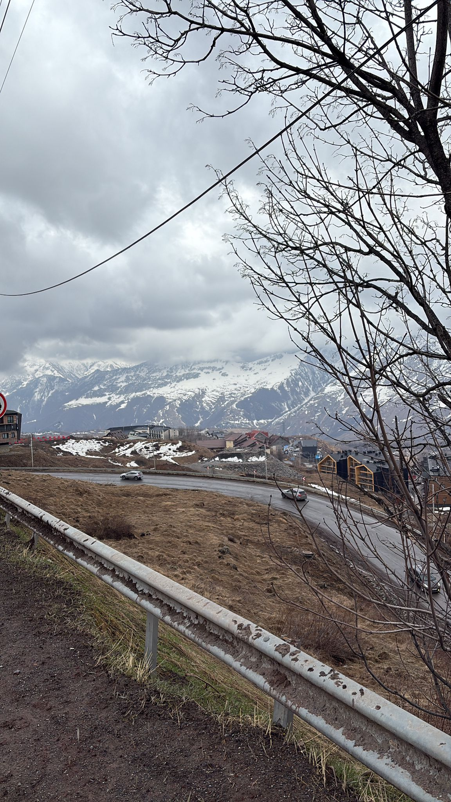
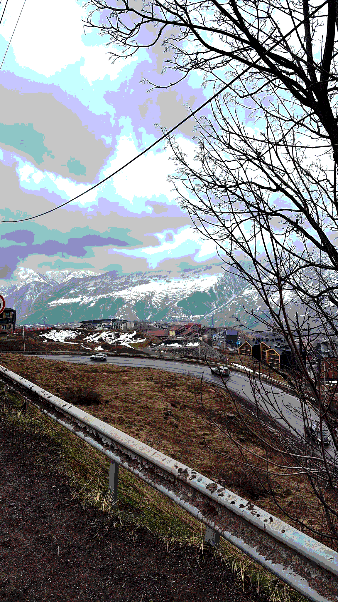
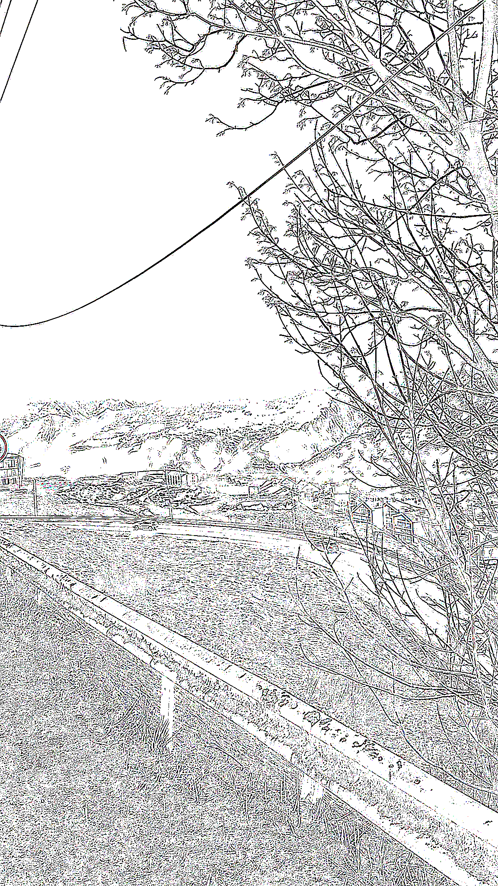

# ASCII Art Converter

A Java program that transforms pictures into ASCII characters.  

  
  
  

## 📖 Usage Instructions

- **exit** → Exit the program  
- **chars** → Show the current character set  
- **add** `<a>` | `<a>-<m>` | `<m>-<a>` | `all` | `space`  
  - Add characters to the set  
  - Example: `add a`, `add a-m`, `add all`, `add space`  
- **remove** `<a>` | `<a>-<m>` | `<m>-<a>` | `all` | `space`  
  - Remove characters from the set  
  - Example: `remove m-z`  
- **res** `up` | `down` | `blank`  
  - Change the resolution of the picture  
  - `blank` shows the current resolution  
- **image** `<filename>.jpeg`  
  - Choose an input image  
- **output** `console` | `html`  
  - Select output format  
- **asciiArt**  
  - Run the algorithm with the current settings 
